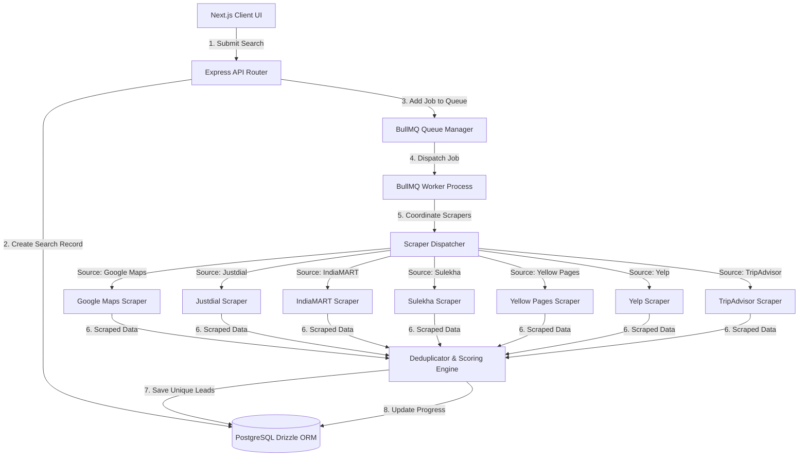

# Technical Blueprint: Multi-Source Lead Scraper Architecture

This document serves as a comprehensive technical specification and architectural blueprint for the development team to extend the lead generation platform into a multi-source scraper. 

---

## 1. System Architecture Overview



---

## 2. Scraping Strategy by Source

To scrape these websites efficiently without getting blocked, the team must employ a hybrid scraping architecture (Browser-based scraping vs. HTTP request-based scraping).

### 2.1 Google Maps (Existing)
* **Method**: Playwright (Headless Browser)
* **Strategy**: Emulate browser scrolling in the Google Maps search sidebar, extract `.hfpx5` elements, click each card to parse details (phone, website, ratings, reviews, address) from the detail panel.
* **Anti-Bot Level**: Medium. Rate limit checks can be triggered if scrolling is too fast.

### 2.2 Yelp
* **Method**: Playwright (Headless Browser) + `puppeteer-extra-plugin-stealth` equivalent for Playwright.
* **Strategy**:
  - Target URL format: `https://www.yelp.com/search?find_desc={keyword}&find_loc={city}+{state}`
  - Parse listing items using classes like `.css-1m051bw` or container list attributes.
  - Paginate using the `&start={offset}` parameter.
* **Anti-Bot Level**: High (Cloudflare Protected).
* **Stealth Requirements**: Must use premium residential proxies, randomized human-like mouse movements, and user-agent rotation.

### 2.3 TripAdvisor
* **Method**: HTTP request-based parsing (Cheerio) as a primary method; fallback to Playwright.
* **Strategy**:
  - Target search page: `https://www.tripadvisor.com/Search?q={keyword}&geo={location}`
  - Parse listing IDs from the search results, then query TripAdvisor's internal GraphQL/JSON API or parse detail pages directly.
* **Anti-Bot Level**: High (Cloudflare & Akamai Protected).
* **Stealth Requirements**: Require cookies extraction and rotation, headers emulation matching browser configurations, and proxy rotation.

### 2.4 Justdial
* **Method**: HTTP Requests (Mobile User-Agent) + Cheerio.
* **Strategy**:
  - Justdial serves lightweight HTML without heavy JS framework requirements when accessed via mobile user-agents.
  - Target URL: `https://t.justdial.com/{city}/{keyword}`
  - Extract names, telephone numbers (often encoded as CSS sprite classes or SVG icons that need mapping, e.g., mapping class names like `.mobilesv` to digits), and ratings.
* **Anti-Bot Level**: Very High (Severe IP blocking and device fingerprinting).
* **Stealth Requirements**: Meticulous emulation of mobile headers. Telephone SVG class-to-digit translation map must be maintained.

### 2.5 IndiaMART
* **Method**: HTTP API inspection + Playwright.
* **Strategy**:
  - IndiaMART relies heavily on dynamic rendering. It is most effective to inspect network calls and emulate the directory AJAX search payloads.
  - Target URL: `https://dir.indiamart.com/search.mp?ss={keyword}&cq={city}`
  - Parse phone numbers, business name, catalog products, and verification badges from the JSON responses.
* **Anti-Bot Level**: Medium.
* **Stealth Requirements**: Rotate API headers and referrer parameters.

### 2.6 Sulekha
* **Method**: HTTP Requests + HTML Parser (Cheerio).
* **Strategy**:
  - Target URL: `https://www.sulekha.com/{keyword}-in-{city}`
  - Parse card lists using static selectors. Sulekha has clean HTML markups containing business names, location, reviews, and categories.
* **Anti-Bot Level**: Low-Medium.
* **Stealth Requirements**: Simple user-agent rotation and standard datacenter proxies are usually sufficient.

### 2.7 Yellow Pages
* **Method**: HTTP Requests + HTML Parser (Cheerio).
* **Strategy**:
  - Target URL: `https://www.yellowpages.com/search?search_terms={keyword}&geo_location_terms={city}`
  - Iterate pagination pages using `&page={page_num}`.
  - Parse selector `div.result` for title, phone, address, and website link.
* **Anti-Bot Level**: Low.
* **Stealth Requirements**: Datacenter proxies and random delay (2–5 seconds).

---

## 3. Data Integration, Merging & Scoring Engine

When scraping from multiple sources, the same business (e.g., "Main Street Gym") might be scraped multiple times. We need a Deduplicator and Merging pipeline.

### 3.1 Normalization
Before comparing leads, normalize their fields:
- **Phone**: Strip all spaces, dashes, parentheses, and leading zeros. Format with country code (E.164).
- **Name**: Convert to lowercase, remove punctuation, business suffixes (like "LLC", "Ltd", "Inc"), and trim spacing.
- **Website**: Normalize to root domain (e.g. `https://www.gym.com/contact` -> `gym.com`).

### 3.2 Deduplication Algorithm
A lead is a duplicate if:
1. Normalized phone numbers match exactly.
2. Normalized websites match exactly.
3. Levenshtein distance of Normalized Names < 3 **AND** addresses share the same street number and postal code.

### 3.3 Data Merging & Lead Scoring
Create a master lead by merging fields from all sources based on field reliability/priority:

| Field | Priority 1 | Priority 2 | Priority 3 |
| :--- | :--- | :--- | :--- |
| **Name** | Google Maps | Yelp | TripAdvisor |
| **Phone** | Google Maps | Justdial / Yellow Pages | Yelp |
| **Website** | Google Maps | Yelp | Sulekha / IndiaMART |
| **Social Links** | Enrichment Worker | Yelp | TripAdvisor |

---

## 4. Anti-Bot and Proxy Configuration Guide

### 4.1 Proxy Rotation Setup
1. **Datacenter Proxies**: Use for Yellow Pages, Sulekha, and Google Maps to keep costs low.
2. **Residential Proxies**: Mandatory for Yelp, TripAdvisor, and Justdial to bypass Cloudflare.
3. **Session Sticky IDs**: Bind a proxy IP to a specific search worker thread so cookies and IPs remain consistent throughout a single pagination crawl.

### 4.2 Browser Fingerprinting Countermeasures
Use `puppeteer-extra-plugin-stealth` or equivalent Playwright hooks to:
- Override `navigator.webdriver` to `undefined`.
- Emulate WebGL, Canvas, and audio fingerprints.
- Match user-agent string exactly with the browser version (Chrome/Firefox/Safari headers).

---

## 5. Development Roadmap (Phase-by-Phase)

### Phase 1: Database & API Core Upgrade
- Implement Drizzle schema migrations to support structured location fields (`country`, `state`, `city`) and `sources` (JSONB array).
- Update next.js forms to display checkboxes for source options.

### Phase 2: Crawler Modules Development
- Create individual scraper modules in `src/services/scrapers/`.
- Standardize the return payload structure for all scrapers:
  ```typescript
  interface ScrapedLead {
    name: string;
    phone?: string;
    website?: string;
    address?: string;
    rating?: number;
    reviews?: number;
    source: string; // "yelp", "justdial", etc.
  }
  ```

### Phase 3: Merger & Deduplicator Integration
- Write the merging/deduplication middleware inside `src/services/deduplication.ts`.
- Merge scraped results and assign scoring metrics to determine the primary contact values.
